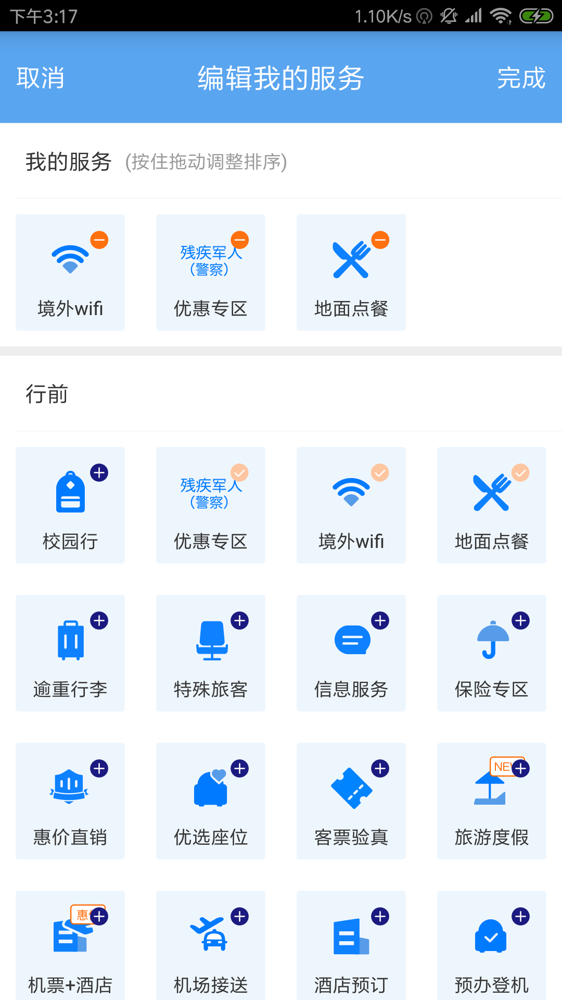
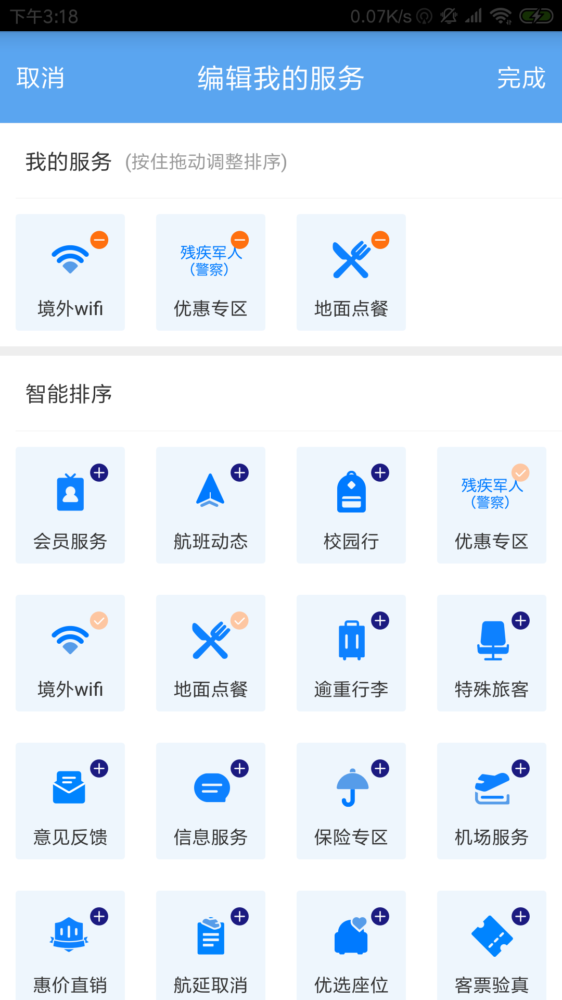
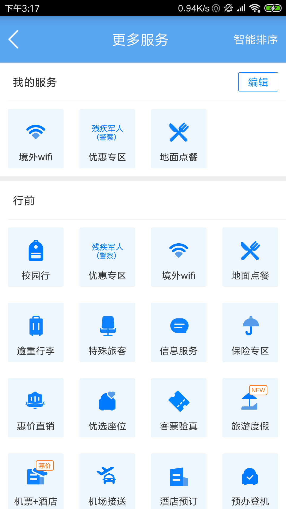
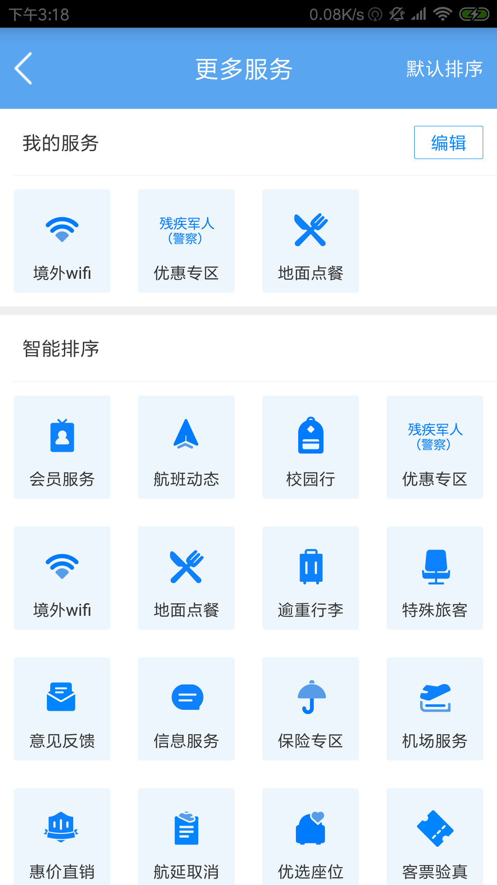

# DragSort
### 拖拽排序
****
#####  撸码原因
     --->每当看到那么优秀交互效果，总想着它该怎么实现，所以心动不如行动!

#####  撸码准备
 * 思路
      * 采用RecyclerView,更加灵活。通过布局管理器可以灵活的设置布局
      * 通过ItemTouchHelper类来处理触摸事件（如拖拽效果，滑动效果等）
      * 关键方法，adpter.setLayoutManager()该方法用于设置布局，必须设置不然不会展示出来
        ，helper.attachToRecyclerView()该方法用于将触摸处理类关联到RecyclerView上。

##### 参考图例

 参考了东航的效果，自己也想弄个新的。

 

 

 

 

#####  编写json
  这些内容，我们一般都是来自于服务器的，所以这里我想先写一个json数据，至于数据内容我们可以看着
  东航这个来写。

  这边有一个在线编辑器: https://qqe2.com/
  大家可以试试。

##### 开始撸码

###### 思路流程
  - 编写json---->主页面采用的UI（标题<linelayout>+内容<recyclerview>;其中recyclerview嵌套recyclerview和gridview实现）---->
  模式（编辑、排序采用两个布尔值进行控制）---->主页面的recyclerview的内容设置（我采用多类型来进行动态布局,在绑定view的时候设置数据和监听，通过
  编辑和排序来控制布局和监听设置）---->我的服务recyclerview的数据和拖拽排序设置---->外部控制我的服务的拖拽排序的开启---->外部控制编辑模式的
  开启---->我的服务拖拽排序的bug修复

  - 在上个提交中，我基本已经完成大部分逻辑，包括拖拽，编辑模式，排序UI等。

  - 下面我们需要，做到真正的编辑模式，即可以通过行前、行中、行后、智能排序等服务组，往我的服务组中添加服务，也可以在我的服务组中，删除自己不感兴趣的服务，修改我的服务组中的排序等。

  思考：
  * 我们有几种业务情景需要模拟？
  1. 我的服务组只是在本地维护（即：当清除用户数据，或者卸载重新安装的时候，是不维护我的服务组里面的内容的。）
  该情景下，服务器那边其实只需要维护好行前、行中、行后、智能排序的服务即可，其他由本地维护。

  2. 我的服务组内容，是需要和服务器那边同步的。（即：只要我的服务组里面的内容发生了改变，如删除、排序等，都得告知服务器用户的改动）
  该情景下，需要增加字段，让服务器告知我，我的服务组中的内容，还有就是其他服务分组的默写服务是否已被添加（这不是必须的，我们也可以通过我的服务组中服务的id号，来确定其他服务组中的服务是否被添加）
  综上，每个服务必须配定id唯一标识，还有最好有一个字段标识是否被添加。

#####  问题记录

   1. recyclerview中嵌套recyclerview、gridview的时候如果不给子布局的宽度指定具体的值，他们是不能完整展示的。（目前可行的方法有，在xml布局给子布局
   设置具体值，或者在绑定布局的时候设置他们的布局属性）

   2. ItemTouchHelper绑定RecyclerView的时候，可在isLongPressDragEnabled回调方法中控制，是否支持长按拖拽。

   3. 在编辑模式和模式和非编辑模式切换的时候，首次长按拖拽没问题，后面再回到编辑模式，出现卡顿，不顺畅甚至无法实现拖拽排序。

   - 问题所在，当我们切换编辑模式的时候，我们需要刷新适配器，此时我的服务中的recyclerview适配器是新建了，但是我们recycler已经在之前绑定了触摸helper，
   导致我们多次绑定，再一个，我们在move方法中进行适配器的刷新的时候，任然用的是首次创建的adapter来刷新，之后我们又新建了adapter导致刷新失败，修改这两处后，
   我们就可以正常操作了。

   4. 我的服务在编辑状态下，点击右上角的移除图标，第一次有效，后面点击出现数组越界
   分析：通过观看日志发现，数组越界

##### 参考资料
  参考博客: https://blog.csdn.net/qq_30379689/article/details/52463139

