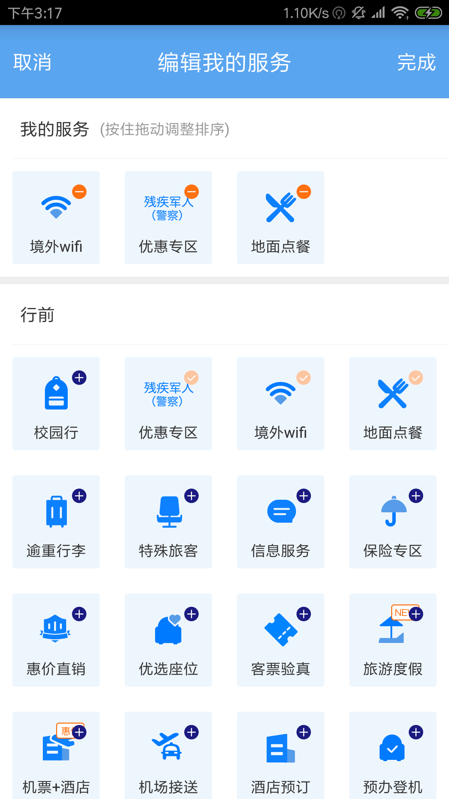
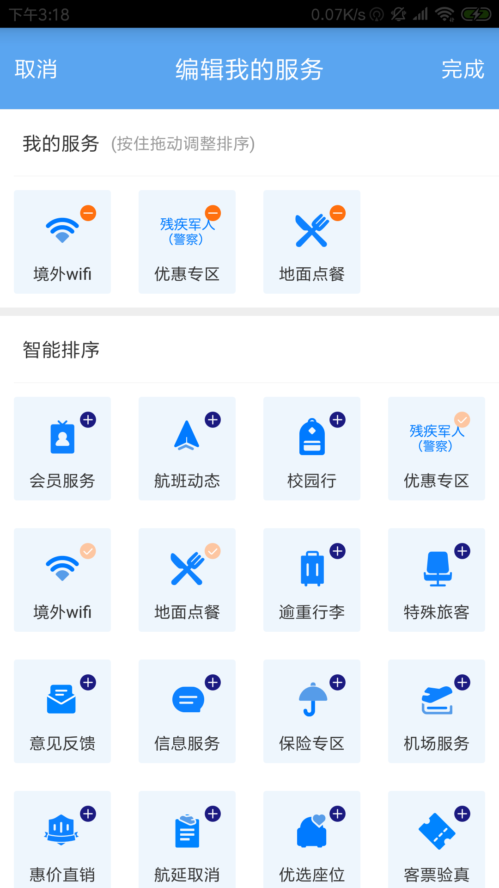
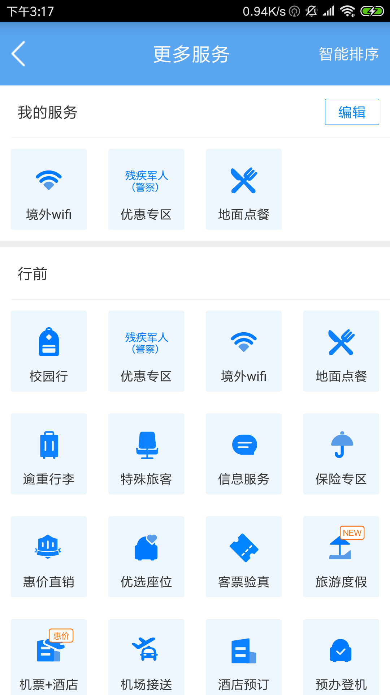
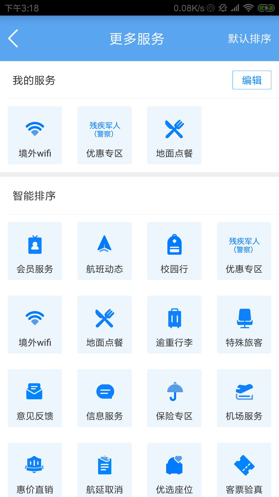

# DragSort
### 拖拽排序
****
#####  撸码原因
     --->每当看到那么优秀交互效果，总想着它该怎么实现，所以心动不如行动!

#####  撸码准备
 * 思路
      * 采用RecyclerView,更加灵活。通过布局管理器可以灵活的设置布局
      * 通过ItemTouchHelper类来处理触摸事件（如拖拽效果，滑动效果等）
      * 关键方法，adpter.setLayoutManager()该方法用于设置布局，必须设置不然不会展示出来
        ，helper.attachToRecyclerView()该方法用于将触摸处理类关联到RecyclerView上。

##### 参考图例

 参考了东航的效果，自己也想弄个新的。

 

 

 

 

#####  编写json
  这些内容，我们一般都是来自于服务器的，所以这里我想先写一个json数据，至于数据内容我们可以看着
  东航这个来写。

  这边有一个在线编辑器: https://qqe2.com/
  大家可以试试。

##### 参考资料
  参考博客: https://blog.csdn.net/qq_30379689/article/details/52463139

